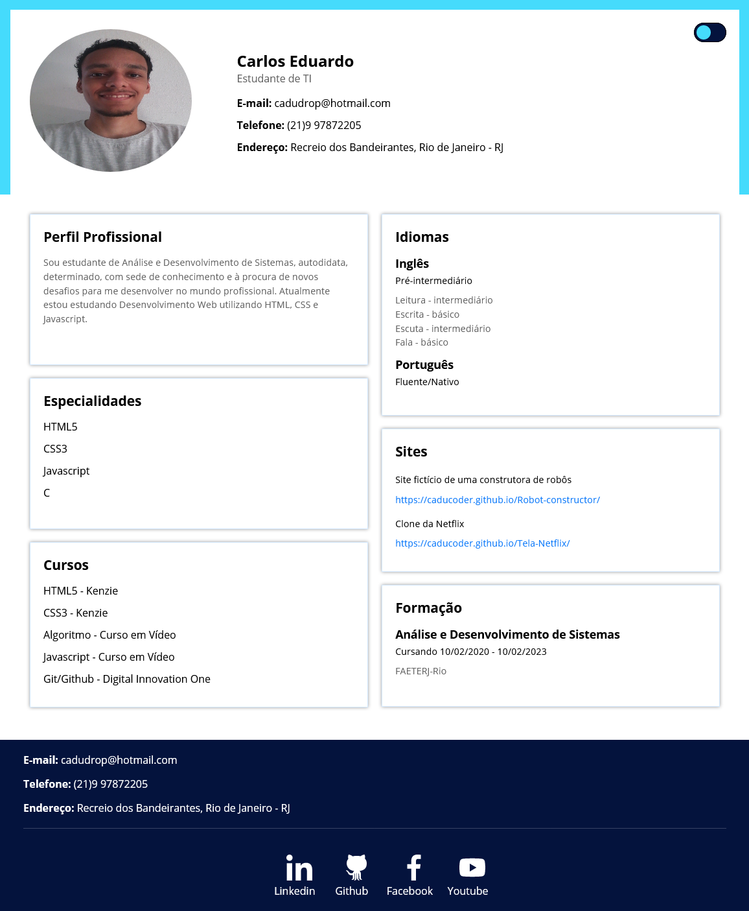

# Portfólio feito na Semana Start sua carreira - Kenzie Academy Brasil

Site portfólio muito maneiro feito no evento da Kenzie Academy Brasil. 


### Screenshot



### Link
 - Portfólio: [Site](https://caducoder.github.io)

 ### Tecnologias utilizadas
 - HTML5 Semântico
 - CSS3
 - Flexbox

 ### O que eu aprendi

 Aprendi a organizar as cores do site utilizando root no css e também aprendi uma maneira incrível de colocar o modo escuro utilizando apenas HTML5 e CSS3.

 ```css
 :root{
   --corBackgroundPrimaria:#45dbfc;
   --corBackgroundSecundaria:#04133d;
   --corBackgroundDark: #0e0e0e;
   --corTextPrimaria: #636363;
   --azul-claro:#0a78fa;
   --corTextSecundaria: #000;
}
 ```
 ```html
 <input type="checkbox" id="ativar-dark" class="ativar-dark">
 <label for="ativar-dark" class="interruptor"><span></span></label>
 ```

 ### Autor
 - Linkedin - [Carlos Silva](https://www.linkedin.com/in/carlos-edu/)